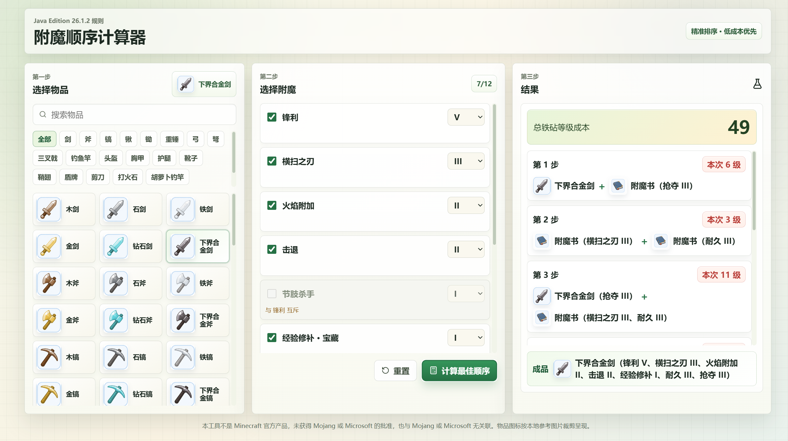

# 我的世界附魔顺序计算器

一个面向普通玩家的小工具，用来计算《我的世界》Java 版中物品与附魔书的合成顺序，尽量降低铁砧等级成本。

## 下载与安装

如果你只是想使用这个工具，不需要安装 Node.js、Rust 或 Tauri。

你只需要：

1. 打开本仓库的 `Releases` 页面
2. 下载最新的 Windows 安装包
3. 双击安装
4. 安装完成后直接打开程序

如果仓库暂时还没有 `Releases`：

1. 打开仓库的 `Actions` 页面
2. 找到 `Build Windows Installer`
3. 下载构建产物中的 Windows 安装包

## 界面预览



## 使用教程

这个工具的使用流程很简单，按从左到右的顺序操作即可。

### 1. 选择要附魔的物品

在左侧面板中选择物品。

- 可以直接点击物品图标
- 也可以用搜索框快速查找
- 还可以按分类筛选，例如剑、斧、镐、弓等

### 2. 勾选需要的附魔

在中间面板中勾选你想要的附魔。

- 勾选后可以在右侧下拉框中选择附魔等级
- 工具会自动限制不兼容的附魔组合
- 当前最多可选择 12 个附魔
- 带有“宝藏”或“诅咒”标记的附魔也会正常显示

### 3. 点击“计算最佳顺序”

选择完成后，点击右下角的 `计算最佳顺序` 按钮。

程序会自动计算：

- 总铁砧等级成本
- 每一步应该先合并哪两本书或哪本书与物品合并
- 最终成品包含哪些附魔

### 4. 按结果顺序在游戏中操作

右侧结果面板会列出完整步骤。

你只需要在游戏里按照显示的顺序，一步一步用铁砧合成即可。

## 示例

如果你要做一把带以下附魔的钻石剑：

- 锋利 V
- 击退 II
- 火焰附加 II
- 抢夺 III
- 耐久 III
- 经验修补 I

那么你可以：

1. 先在左侧选择 `钻石剑`
2. 在中间勾选以上附魔
3. 点击 `计算最佳顺序`
4. 按右侧给出的步骤在铁砧中依次合成

## 常见问题

### 普通使用者需要安装 Node.js、Rust、Tauri 吗？

不需要。

只有在你想自己修改源码、在本地开发、或者自己打包安装程序时，才需要安装这些开发依赖。

### 这个工具适用于哪个版本？

当前界面和规则以 `Java Edition 1.21.6` 为准。

### 为什么有些附魔不能同时勾选？

因为这些附魔在游戏规则中互相冲突，不能出现在同一件物品上。工具会自动帮你拦下这类组合。

### 为什么点击计算后没有结果？

可能原因包括：

- 还没有选择任何附魔
- 选择的组合不合法
- 当前组合无法按规则完成合成

可以尝试减少附魔数量，或者重新检查是否存在冲突。

## 从源码运行

这一节只给想自己开发或打包的人使用。普通用户可以跳过。

### 环境要求

- Node.js 20 或更高版本
- Rust
- Windows 上的 Tauri 构建依赖

### 安装依赖

```bash
npm install
```

### 启动开发版

```bash
npm run tauri:dev
```

### 构建安装包

```bash
npm run tauri:build
```

构建完成后，安装包通常会出现在：

```text
src-tauri/target/release/bundle/
```

### 其他常用命令

```bash
npm run build
npm test
```
